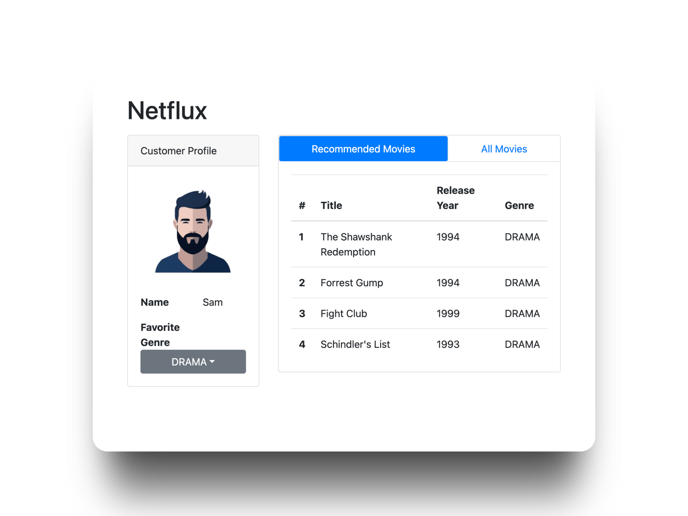

# Netflux AWS

Este proyecto es un ejemplo desarrollado como parte del curso **"AWS Cloud Architecture For Java Spring Boot Developers"** en Udemy.

## Demo en línea

Puedes probar el aplicativo desplegado en AWS en el siguiente enlace:

[https://d32rroo05zvsbh.cloudfront.net/](https://d32rroo05zvsbh.cloudfront.net/)

## Ejemplo de Interfaz

A continuación se muestra una imagen de referencia de la interfaz de usuario del sistema:



---

> Este repositorio contiene los servicios y recursos necesarios para ejecutar la aplicación de recomendación de películas basada en Spring Boot y AWS.

# Customer Movie Service

Este repositorio contiene dos servicios principales desarrollados con Spring Boot:

1. **Customer Service**: Gestiona la información de los clientes y sus géneros favoritos.
2. **Movie Service**: Proporciona información sobre películas, filtradas por género.

## Estructura del Proyecto

- **customer-service/**: Servicio para la gestión de clientes.
- **movie-service/**: Servicio para la gestión de películas.
- **postgres/**: Configuración de la base de datos PostgreSQL con Docker.

## Requisitos

- Java 21
- Maven
- Docker (para la base de datos)

## Configuración

Asegúrate de configurar las propiedades en `application.properties` para cada servicio, como la URL de la base de datos y las credenciales.

## Ejecución

1. Inicia la base de datos con Docker:
   ```bash
   docker-compose up -d
   ```
2. Ejecuta cada servicio con Maven:
   ```bash
   ./mvnw spring-boot:run
   ```

## Notas

- La carpeta `.vscode` está excluida del control de versiones.
